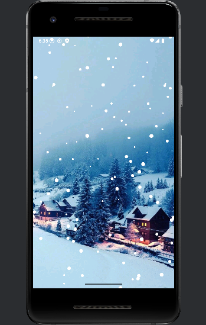

# ❄️ SnowySceneApp

눈송이가 내리는 겨울 풍경을 표현한 Android 앱입니다.  
SurfaceView를 활용해 배경 위로 눈이 자연스럽게 떨어지는 장면을 구현했습니다.

---

## 📱 주요 기능

- `SurfaceView`를 이용한 고성능 커스텀 드로잉
- 눈송이 애니메이션 (랜덤 위치, 크기, 속도)
- 배경 이미지 위에 자연스럽게 눈이 내리는 효과
- 이후 확장: 눈 크기/개수 조절, 퍼짐 효과 등 가능

---

## 🏗️ 프로젝트 구조

```
📁 app/
 ├── java/com/example/snowyscene/
 │    ├── MainActivity.java       # 메인 액티비티
 │    ├── SnowView.java           # 눈 내리는 커스텀 뷰
 │    └── Snowflake.java          # 눈송이 데이터 클래스
 ├── res/
 │    ├── layout/activity_main.xml  # 레이아웃 XML
 │    ├── drawable/snow.jpg         # 배경 이미지
 │    └── values/...                # colors, styles 등
```

---

## 📄 주요 코드

### 🎨 `SnowView.java`

```java
public SnowView(Context context, AttributeSet attrs) {
    super(context, attrs);
    getHolder().addCallback(this);
    background = BitmapFactory.decodeResource(getResources(), R.drawable.snow);
    snowflakes = new ArrayList<>();
}
```

---

## 🖼️ 실행 화면 (예시)

### 📸 앱 구동 화면



---

## 🛠️ 실행 방법

1. Android Studio에서 새 프로젝트 생성
2. 위 파일 구조에 맞게 Java 소스코드 및 `activity_main.xml` 작성
3. `drawable` 폴더에 `snow.jpg` 추가 (소문자 이름, 공백/대문자/한글 ❌)
4. 앱 실행

---

## 🔧 사용 기술

- Java
- SurfaceView
- Canvas, Paint
- Bitmap
- Thread

---

## ✨ 앞으로 확장 가능 기능

- 눈송이 개수/크기 조절 SeekBar UI 추가
- 눈 퍼짐 효과 / 충돌 반응
- 멀티터치 인터랙션 추가
- 눈송이 이미지화 및 투명도 효과

---

## 📦 라이선스

본 프로젝트는 MIT 라이선스를 따릅니다.  
자유롭게 사용/수정/배포 가능합니다.
